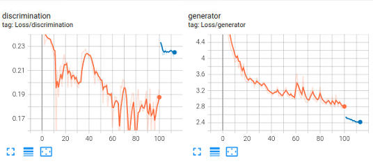
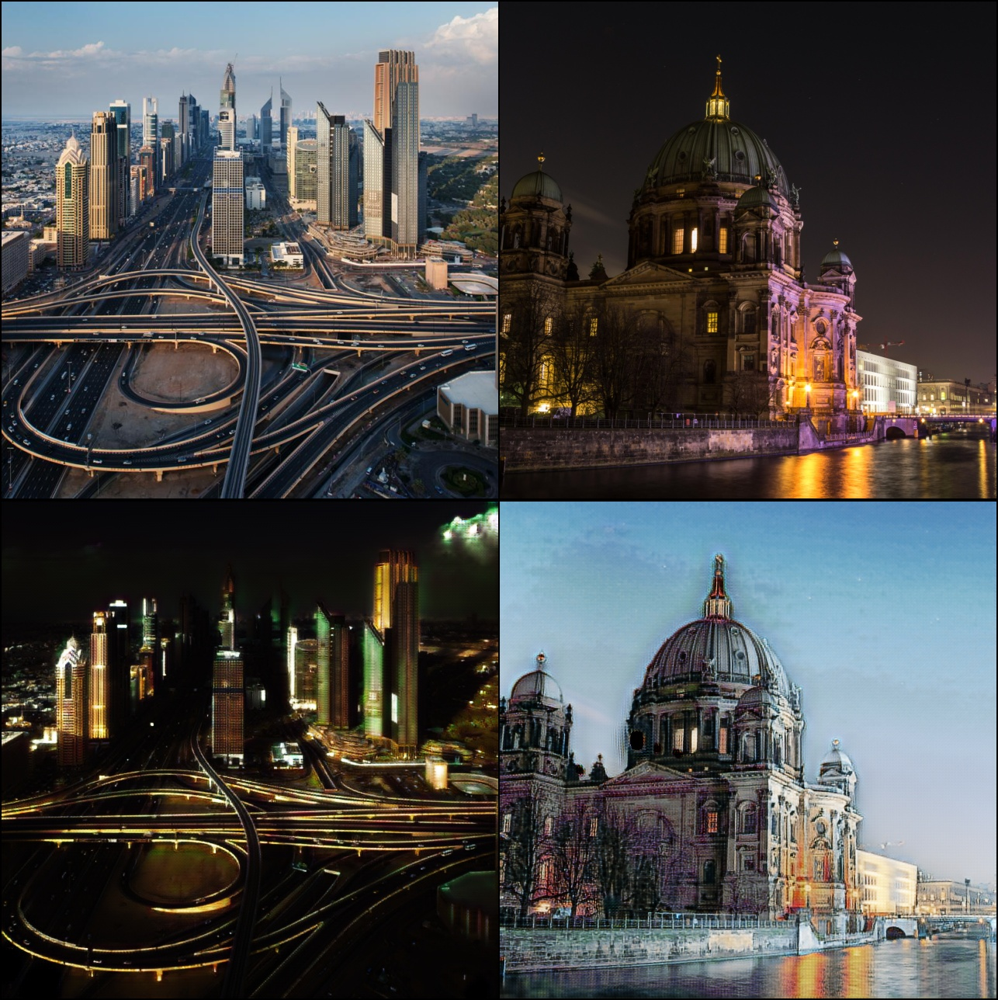
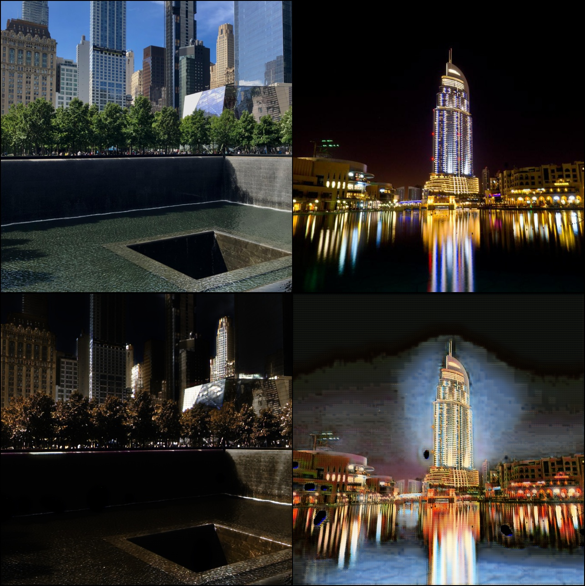
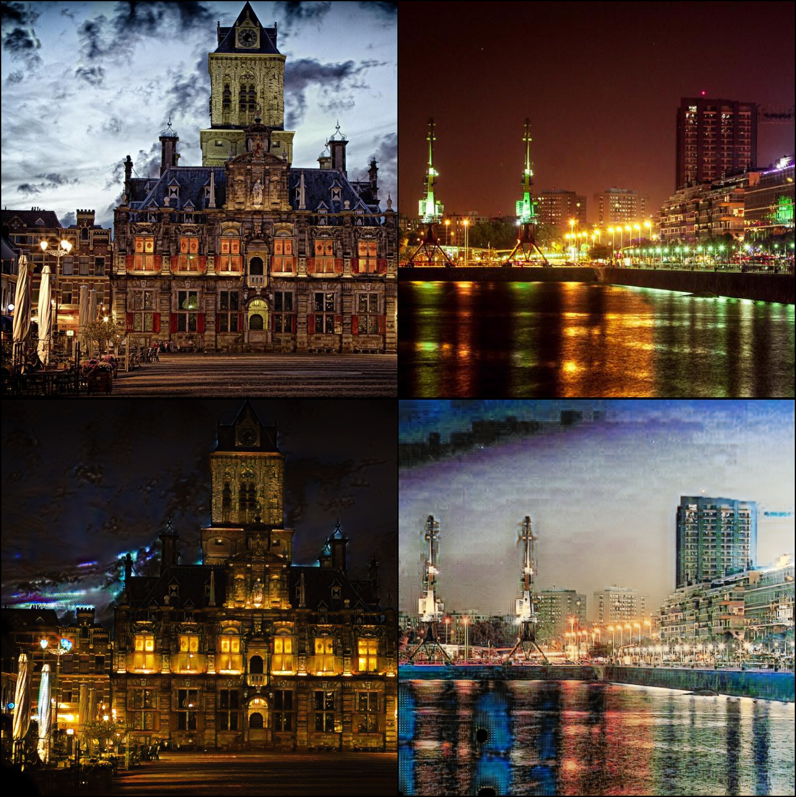

# Cycle Gans in image traslation

## Overview

This repository contains code for training Cycle Gans model. The model is trained to investigate the ability of image translation from an unpaired datset, and it uses unpaired day and night cityview dataset obtained from [Kaggle](https://www.kaggle.com/datasets/heonh0/daynight-cityview).

## How to use my code
To reproduce the results, follow the steps below:
1. Clone the repository:
```
https://github.com/HoangPham10/CycleGANs-in-image-translation.git
```
2. Install the dependencies

3. Prepare dataset
You could download dataset from [Kaggle](https://www.kaggle.com/datasets/heonh0/daynight-cityview) or create them by yourself. 
In case you create yourself, you need to create two folders `day` and `night` and put your day images into `data\day` or night images into `data\night`.

4. Train the model:
Edit the `config.py` or `cyclegan.ipynb` if you want to run in jupyter notebook to get the right path for dataset

Run the `cyclegan.ipynb` or use the command:

 `python train.py`

5. Inference
You can download pretrained models and see all the visualization in this [link](https://drive.google.com/drive/folders/1OMqm_9Xl3M-BQvaRWwknS5p5juCQW4cz?usp=drive_link)

6. Experiment
I run experiment in NVIDIA RTX3090 24gb GPU. Here is the training curve
- **loss_curve**
 

7. Some visualizaton
 

 

 

